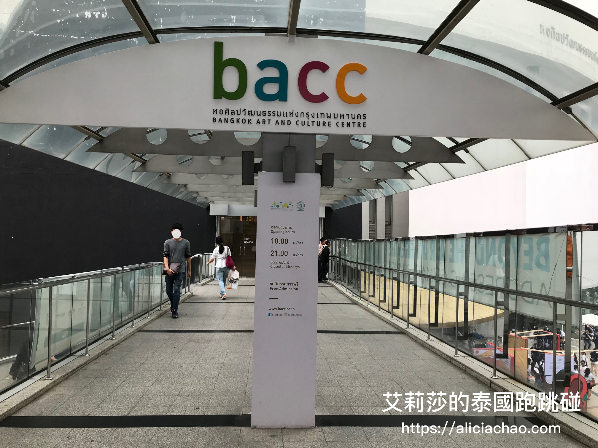
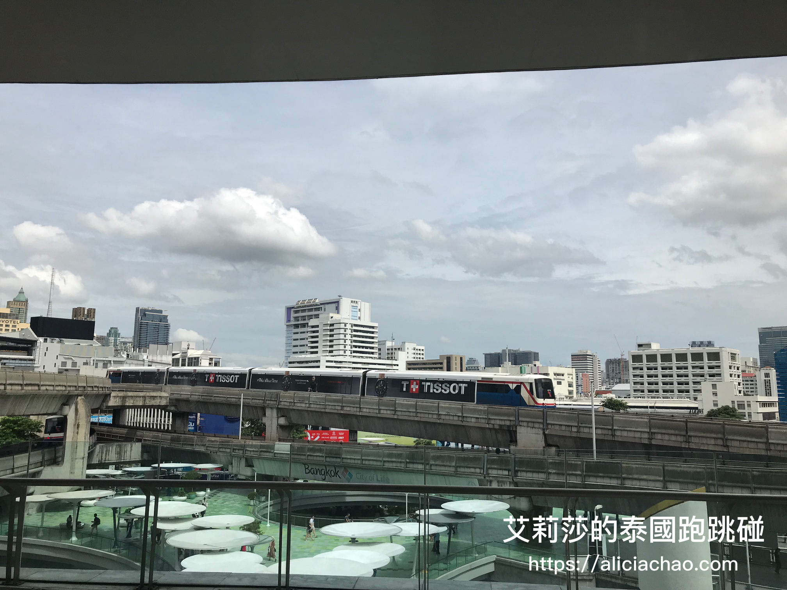

# \<泰國曼谷推薦\> 吃吃喝喝也要很文青，曼谷藝術文化中心 BACC & Gallery Drip Coffee

來曼谷可以怎麼玩？除了可以體驗划算到不行的按摩、吃酸辣開胃的泰國菜外，還可以來泰國文青一下。我常經過曼谷藝術文化中心 BACC 時就會順便到 Gallery Drip Coffee 買一杯咖啡享用，順便讓自己沈浸在這個充滿藝術的氛圍中，提升一點氣質？！當個偽文青～（偷笑) 今天這篇就來跟大家介紹一下文青必訪的**曼谷藝術文化中心** ＆ 總是人滿滿的 **Gallery Drip Coffee** 咖啡廳。

### **曼谷文化藝術中心**

曼谷藝術文化中心 （**B**angkok **A**rt and **C**ulture **C**enter） 位在 BTS National Stadium站，一出 BTS 空鐵即有連通道到 BACC，它的所在位置十分方便，走個五分鐘即可抵達 MBK 百貨或 Siam Discovery。
  

藝術中心空間以**圓弧性**的概念設計，而整體白色的建築主色系，自然採光透射進建築物再搭上內部柔和的黃光，我逛起覺得蠻輕鬆自在的。當然也不免俗拿起手機東拍拍西拍拍，果然在藝術中心拍照起來的效果真的很不賴呢！
  
在 BACC 裡較高的樓層，還可以由內往外看到外頭景色，因緊鄰 BTS，運氣好的話還可以看到空鐵在你面前行駛過去。

這裡在走道上不但有攝影照片展出，在展間也有不同的主題活動陳列，還有特色咖啡廳（也就是待會要介紹的Gallery Drip Coffee）與小吃店，欣賞藝術同時也要照顧好飢餓的胃！這次我印象比較深刻的是泰國小學生建築展，有點像讓小朋友做專案，從發想概念到實際做成模型的成果展，覺得還蠻振奮人心的。如果以前我那個年代(遠望🧐)，國小有這樣的課程，應該能創造出蠻多回憶。

另外，這裡有蠻多文創小攤（如包包 & 手作飾品 ＆帽子...等 )，賣的商品覺得還算便宜划算，我在這邊不小心手滑了買了帽子跟包包，推薦大家可以來逛逛挖寶。
 

### **Gallery Drip Coffee**

會注意到 Gallery Drip Coffee 是因爲在逛 BACC 的時候發現：媽呀～這間咖啡店怎麼這麼多人，好奇心驅使下便到店裡瞧瞧！Gallery Drip Coffee 就在 BACC 的一樓，店內空間不大但是相當有特色，算是小巧別緻的店家。

牆面櫃中的咖啡器具珍藏，可以看得出來老闆對咖啡的熱情與喜愛已到了癡狂的境界！！真的令人歎為觀止～咖啡的愛好者會很有收穫！

Gallery Drip Coffee 主打**手沖**咖啡，店內有離手沖吧檯很近的位子，可以讓你近距離看職人在煮咖啡上的專注！

Gallery Drip Coffee 的咖啡在曼谷偏中價位，大概比台灣LOUISA的咖啡再貴一些些。

我們點的是冰拿鐵與熱抹茶，熱抹茶表現的不錯，喝起來部會太甜，有濃濃的抹茶香 ; 冰拿鐵的部分，友人不是很喜歡，可能是因為這邊的拿鐵直接用手沖咖啡加牛奶，而不是用Espresso調製而成，所以喝不太習慣。有來 Gallery Drip Coffee 的朋友，建議可以直接點手沖咖啡就好囉！

---- 
** 曼谷藝術文化中心 BACC - Gallery Drip Coffee**

地址：939 Rama I Rd, Khwaeng Wang Mai, Khet Pathum Wan, Krung Thep Maha Nakhon 10330  
[（怎麼走）](https://goo.gl/maps/pQjcgNkit7m)  
營業時間：Tue-Sun，10:00-21:00  
特色：手沖咖啡、藝術文青風

