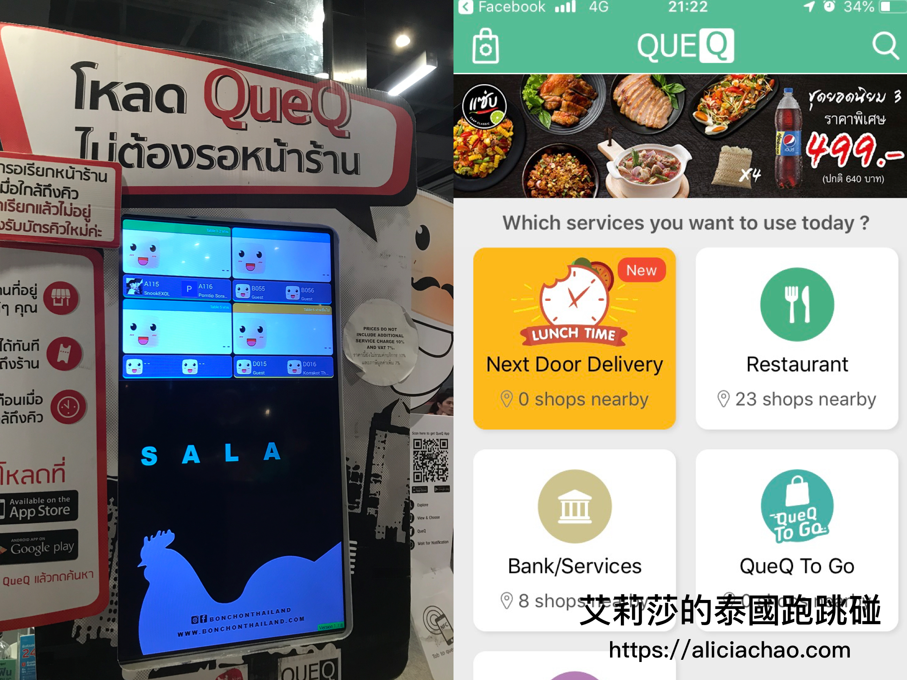

\<泰國曼谷推薦\> 外送內用都好吃的吮指韓國炸雞 Bon Chon

被 CNN 美食家評選為最美味炸雞的 Bon Chon，在全球有超過 300 間的連鎖店，它的好滋味深深埋在我的記憶中。頭一次吃 Bon Chon 是大概 7-8 年前在波士頓朋友家訂的外送，我印象很深刻當時吃完這家的炸雞，隔天朋友問我晚餐有沒有想吃什麼，我立馬反射回答：「有有有～我要吃跟昨天一樣的炸雞！！」，於是我就在波士頓連吃了兩天 Bon Chon 心滿意足地回國了。每次跟朋友聚會，朋友也一直把這個回憶拿出來取笑我，但在我心中好吃炸雞已跟 Bon Chon 劃上等號了！

這次到曼谷旅遊當然也不能錯過這個大好機會，早就做好功課，查好曼谷的分店在哪裡，一下飛機就直衝 Siam Center 這間吃炸雞。待在曼谷兩個月，Bon Chon 大概是我**最頻繁**去的餐廳（大概造訪了 4 次加上 3 次 Food Panda外送) ，去過 Central World & Siam Center 兩間分店，Siam Center 店面座位較少，但排隊人潮依舊很多，平均要等20分鐘左右 ; Central World 門市座位比較多，所以我們沒有等就直接有位子坐。

## 店內用餐
### 排隊 - 事先下載排隊 app 或現場跟服務人員取號碼牌
如果不想等太久的話，可以試看看下載他們排隊的 App : **QueQ **，讓你可以不用等到現場才跟服務人員拿號碼牌。我去吃 Bon Chon 大多是很臨時決定，自己是沒有實際用過這個 APP，需要的朋友參考看看。
  

### 點餐
來 Bon Chon 當然不能錯過招牌的韓式炸雞啦！通常兩個人吃我都會點一份小份（6塊）的 Boneless Breasts 無骨雞胸，配上韓式豆腐鍋或是炒烏龍麵。三個人吃的話，則會點中份（10 塊）配上一些開胃菜（招牌 Bon Chon 薯條)。

- **炸雞** （極力推薦）: 自己偏好無骨頭的炸雞，比較可以吃肉吃得盡興？！無骨雞胸跟雞腿，我會較**推薦點雞胸肉**，有一次點雞腿吃到較多較肥的油脂。炸雞有三種口味可以選擇：**醬燒蒜味 **(Soy Garlic)、**辣味** (Hot)、**脆皮蒜味**（Crunchy Garlic），如果點中或大份的話，可以選擇兩種口味、一次滿足。這邊的辣味炸雞，剛開始吃覺得普通不會太辣，但越吃會越覺得辣的後勁很強，覺得辣得很過癮。如果不嗜辣或吃台灣口味小辣的人，建議還是點另外兩種不辣的口味喔！
	
	炸雞套餐會附上醃蘿蔔，醃蘿蔔酸甜的口味，配上炸雞很剛好。另外配菜部分，我通常選擇的是糯米飯（Sticky Rice)，繼上次去泰國烹飪教室學到泰國糯米飯是使用獨特器具，除了覺得很特別外，自己也很喜歡泰國糯米飯的口感跟嚼勁。上次在烹飪教室忘記拍泰國蒸糯米飯的器具，偶然在路上剛好看到路邊小販有在蒸糯米飯，趕緊拍下來。就是這個道具～將糯米放在竹編簍子，然後藉由下面的蒸氣將米飯蒸熟！
	
-  **招牌 Bon Chon 薯條** （推薦） : 剛酥炸出來的薯條加上調味的起士粉跟大蒜粉，很像麥當勞搖搖薯條的升級版。  
	
- **韓式餃子豆腐鍋** （普通) : 蠻多人點豆腐鍋，上桌時會幫你打一顆蛋在上面。我個人覺得Bon Chon的炸物類表現比較佳，餃子豆腐鍋沒有表現特別突出。
	  
	
- **炒烏龍麵**  （不推）: 我印象中在波士頓吃的烏龍麵吃完意猶未盡，但在曼谷的口味完全不一樣，老實說曼谷 Bon Chon 的炒烏龍麵調味太中讓，吃完相當失望。
	

## 店內用餐
在曼谷用 Food Panda 外送相當方便，且 Bon Chon 又很佛心的常出現**免外送費**，真的很容易就會不小心手癢打開 Food Panda 點份炸雞來吃。

外送我都點小份炸雞餐，在自己隨便弄個簡單的炒青菜，2 個人吃就可以就可以吃得很彭湃。吃不完的炸雞還可以切小塊隔天炒飯來吃，不僅方便實惠，冷掉的炸雞再加熱後，味道口感還是頗好的！

Bon Chon 炸雞酥脆的口感醬料，讓我連沾在嘴角旁的屑屑都不想錯過！（是有沒有這麼貪吃 T^T ）希望有招一日可以到韓國吃看看當地的 Bon Chon  是不是比曼谷更厲害！
---- 
** Bon Chon - Siam Center 4F**  
營業時間：Sun - Sat，10:00-22:00  
地址：989 Rama I Rd, Khwaeng Pathum Wan, Khet Pathum Wan, Krung Thep Maha Nakhon 10330  
[（怎麼走）](https://goo.gl/maps/gTGZ5Gh6XaT2)  
特色：炸雞必點、酥脆夠味
  

  

