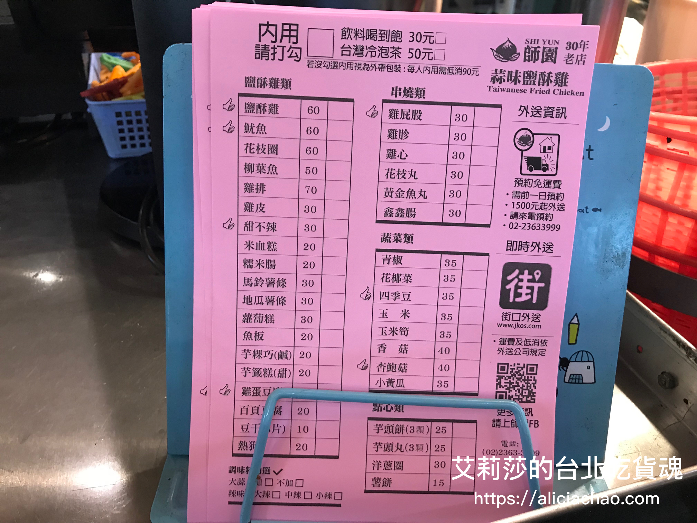

\<師大必吃美食\> 就算罪惡感爆表，也不顧一切要吃的「師園 鹹酥雞」

有時侯勞累的時候或阿雜時，腦波總是特別的弱，腳總是會不受大腦控制自動前往鹹酥雞攤或派克雞排買罪惡的炸物，彷彿自己的腳跟大腦是分離的lol。但是炸物配上一口冰冰涼涼的啤酒，真的是人生一大享受啊（蘇胡）。找藉口的說法就是：吃炸物可以cheer myself up，提升心理爽快感! 

今天要介紹的是師大夜市裡知名的小吃**「師園 鹹酥雞」**，標榜**蒜味**口味，我覺得是屬於口味偏重的鹹酥雞店家。還沒搬到師大住的時候，每次來師大逛街固定拜訪的美食就是：師園鹹酥雞＆大台北滷味 ; 搬到師大附近住了快要半年，為了訓練自己的忍功，盡量在一個月內控制炸物攝取量～所以常經過這攤如果是吞了幾口口水從攤位前飄走時，就會覺得自己意志力十足! 內心給自己小掌聲～ (顯示為評估標準薄弱ＸＤ)

師園鹹酥雞久久以前有改裝一次，改裝之後的店面變得比較明亮乾淨，店面旁邊也有座位可以內用(每人低消90元)，覺得內用還要點其他東西很不符合CP值，所以大多都是外帶為主。

師園鹹酥雞的品項相當多＆豐富，可能就是因為品項太多容易造成每項都想吃一點，很容易在沒評估好自己斤兩就夾超量了。

可以選擇直接在攤位用夾的、填單或直接跟在收銀機的店員點你要的炸物，填單就在點餐機旁邊，蠻好找到的！

點餐時，店員會問你要不要辣跟蒜頭，通常我都會再請店員幫我**多加一點蒜**，蒜味配上鹹酥雞還有附加一些九層塔，吃起來真的很搭、很對味啊！我這次因為是一個人吃，只敢點三樣（鹹酥雞、新鮮的魷魚與吃不膩的地瓜薯條），原本以為份量應該還ok--\>顯示為吃貨的胃😱，但把它倒出來是大大一盤啊～後來吃到太撐只好把剩下的隔天再熱來吃，下次點餐之前要先看一下腰圍再夾，不然就要等到多人聚會才能一次大買特買，每樣都吃到！

  
  

