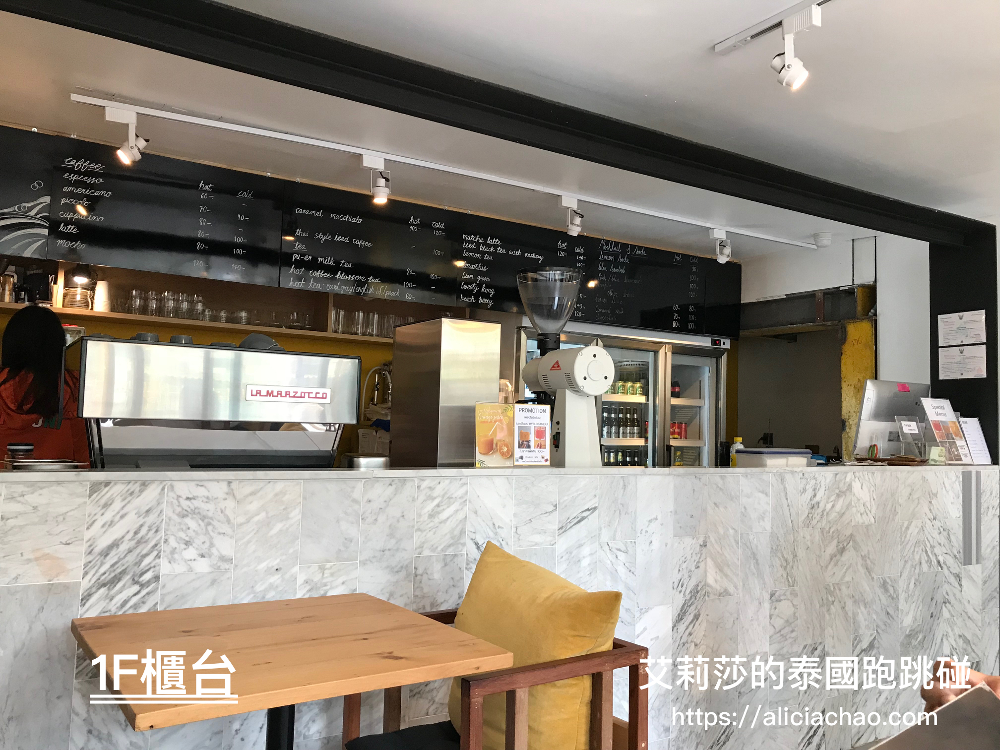
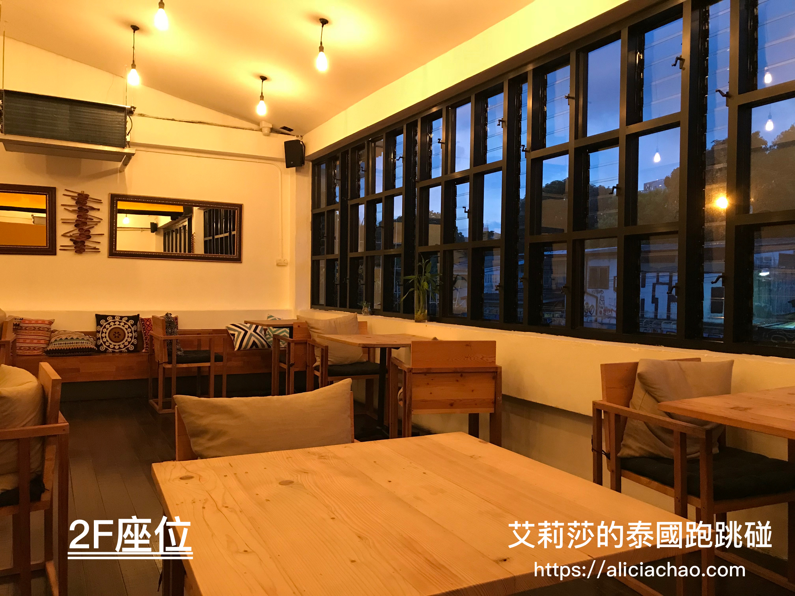

# \<泰國曼谷推薦\> 河岸旁的驚喜：清新文藝咖啡廳  Yelo House - Hungry Me & Thirsty You Cafe
會造訪 Yelo House - Hungry Me & Thirsty You 這間咖啡廳是因為在曼谷認識一位俄羅斯女生，她極力推薦一定要來這間咖啡館試看看，並用堅定的語氣告訴我，去了絕對不會失望。抱持著半信半疑的心情，決定親自造訪一探究竟。
### ** 河岸驚喜**
我是由空盛桑運河（Khlong Saen Saep）這一側的小路前往 Yelo House ，途中會看到有賣快炒類的路邊攤販，伴隨的路邊攤的食物味及產生波濤水花的運河快艇（也稱**髒船**：空盛桑運河的水漂浮的垃圾，水質也髒的令人怯步，所以也有人稱這邊快艇為髒船），心裡還是很狐疑座落在這樣環境的 Yelo House 會是間什麼樣子的店呢?! 

到了 Yelo House 馬上被它的外觀吸引，咖啡廳一半的屋簷與面向運河的窗戶，投射進室外的**自然採光**，咖啡廳在運河的突顯下，更顯明亮且獨樹一幟。咖啡廳裝潢簡單明亮，加上輕柔的音樂與黃色柔光，很容易讓人陷入悠閒的氛圍，是一間值得耗上整個下午品嚐美食、咖啡並參觀藝文的好地方。

Yelo House 以黃色與黑色為主色調搭配採光度十足的窗戶，白天讓採光自然的投射到咖啡廳裡面 ; 晚上則是反之由 Yelo House 柔光黃燈投映到河岸，為運河增添不少情調。

### **藝廊空間 x 特色商品小店 x 沖印菲林底片**
Yelo House 是由舊倉庫改裝，內部空間相當寬敞，裡面不僅有咖啡廳、專業沖印傳統底片的店家、特色文藝小商店及寬闊的藝廊空間不定期舉辦活動或畫展，不但吸引不少觀光客來參觀，甚至還有看到 Model 特地來這邊外拍！除了可以來這邊當個文青之外，還有一個距離這裡約 10 分鐘左右路程的[「曼谷藝術文化中心 BACC」](https://wordpress.com/post/aliciachao.com/236)⬅️點這裡，讓你來曼谷觀光，不僅百貨公司逛得開心，也提升內在知性美！😏

- 藝廊空間：一樓及二樓的藝文空間，不定期會舉辦活動或是畫展，這次前往的時碰上畫展，展區牆面會有海報公告近期活動行程表，有興趣的朋友可以特別留意。  
	  
	

-  特色商品小店：Yelo House 裏大概有 2-3 間的小店，有賣明信片、手提包包、衣服、墨鏡...等，個人認為曼谷藝術文化中心裡商品選擇相對起來較多元，也比好逛！  
	  
	

- 專業沖印底片的店家：這間專門沖印底片的店家，店內總是聚集著攝影愛好者。雖然不是攝影迷，但是牆面上膠卷與底片，還是喚醒我小時候用相機的復古情懷。  
	

### **Hungry Me & Thirsty You Cafe**
- **氣氛好、採光足** : 會讓我想推薦這家咖啡廳，我覺得很重要的是讓我留下很好的用餐體驗，而這個好的用餐體驗是由內部裝潢設計與氛圍佔了絕大部分的比重，自然的太陽採光灑落在你的身上，再配上一杯咖啡，喝起咖啡都覺得脫俗了起來。☀️  
	咖啡廳有一樓及二樓的位置，二樓位子數比一樓來得多。我個人較推薦大家坐在一樓位子，除了採光較好外，服務人員也多集中在一樓，點餐比較方便。  
	
	

- 這裡也有**泰國菜**：有別於一般咖啡廳只提供飲品與糕點，這邊也可以吃到道地的泰國菜（如打拋豬、冬蔭功...等等），第一次我們造訪選擇了打拋豬的 Lunch Set （副餐包含可樂、雪碧等氣泡飲，價格約 120-180 泰銖左右），比外面的泰國菜稍微貴一些，餐點表現中間偏上。提醒大家在泰國點餐的時候，一定要特別在**點餐的時候説辣度不要太辣**，不然以泰國人嗜辣的烹調口味來說，有些原本可口的餐點可能會辣到無法吃完。  
	

- 飲品與甜點：我蠻喜歡這邊的用餐環境跟氛圍，所以我有時候會跑來這點杯咖啡，寫寫旅遊日記，不知不覺被這家咖啡廳的環境收買，成了忠實顧客？！
	 飲品：造訪了幾次，點過冰拿鐵、冰美式、熱抹茶拿鐵、熱摩卡咖啡。跟台灣不太一樣的是這邊熱飲比冰飲便宜，剛看到的時候還有點不習慣。幾杯飲品當中，我個人比較推薦的是「熱抹茶拿鐵」，除了拉花相當漂亮外，抹茶拿鐵上的綿密泡泡與不甜抹茶味調和的非常完美！  
	  
	  
	
	 甜點：可以到甜點櫃選擇想要的蛋糕，蛋糕口味會做變化，每次去看到的口味都稍有不同。除了蛋糕外，我點了鬆餅來配咖啡，鬆餅可以額外加 30 泰銖加一球冰淇淋。這邊鬆餅偏軟，不是外皮酥脆內餡蓬鬆的鬆餅，鮮奶油綿密不膩口（雖然我不是鮮奶油愛好者，但是我覺得還不錯吃)，鬆餅部分因為餅皮不脆讓我覺得略顯遜色，如果鬆餅能外皮脆脆的那就更好了！！  
	  
	

非常推薦大家來泰國曼谷如果有造訪 Siam 及 MBK 商圈，可以再走幾分鐘來隱身河畔的 Yelo House 參觀並喝杯咖啡享受陽光。
---- 
** Yelo House**  
營業時間：Wed-Mon，11:00-20:00

** Hungry Me & Thirsty You Cafe**
營業時間：Sun-Thu，8:00-20:00 / Fri-Sat，8:00-22:00  
地址：20/2 Rama I Rd, Khwaeng Wang Mai, Khet Pathum Wan, Krung Thep Maha Nakhon 10330  
[（怎麼走）](https://goo.gl/maps/uA9Rd1GyhEA2)  
官網：[www.yelohouse.com](www.yelohouse.com)  
特色：環境舒適有特色、採光佳、藝術文青風

