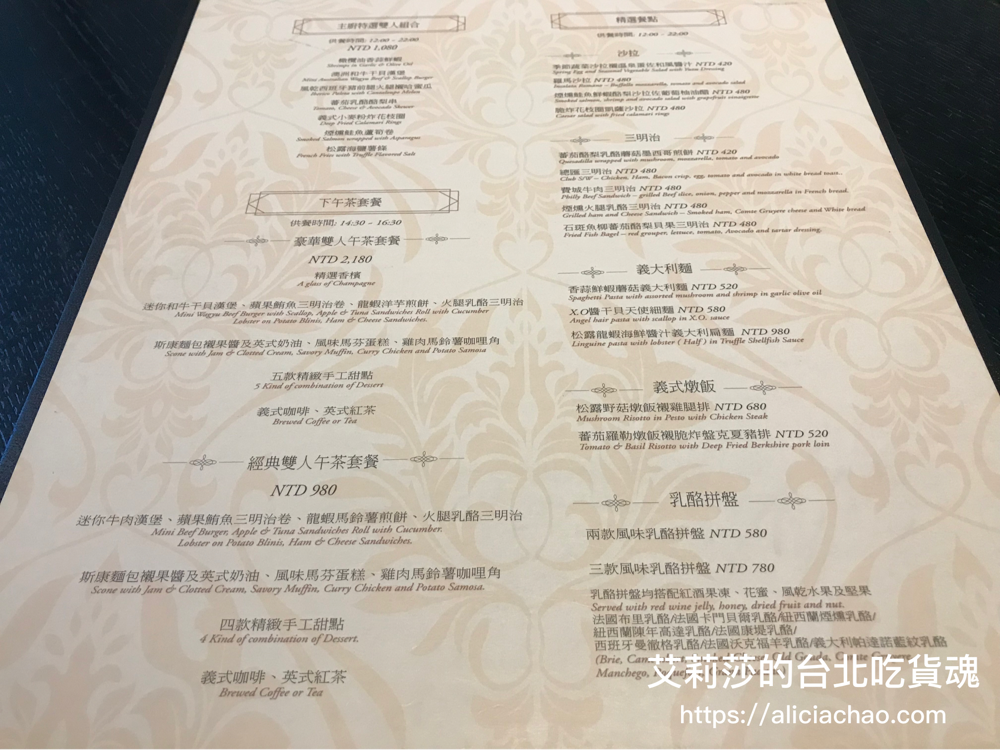

\<台北下午茶\> 小資族的貴婦下午茶a3

一直以來對 Bellavita 貴婦百貨裡賣的東西或餐廳都有一種高貴、昂貴的印象，除了樓下**分享餐廳**跟**星巴克**久久犒賞自己，覺得是小資負擔得起之外，其他餐廳價位在我記憶裡是**很貴婦**的價格。雖然貴婦百貨的東西不便宜，但有時候路過我會特別進去晃一晃，因為我相當喜歡這邊屋頂透光採光罩，讓陽光肆意地灑進百貨公司內，提升整體空間明亮與舒適自然的氛圍。  

這次剛好托姊姊之福，讓我有機會享受當貴婦的小確幸，一起到這間氣氛跟餐點都表現不錯的 a3 來享用下午茶。
a3 是一間結合餐廳、下午茶跟 Bar 多元化經營的新義式餐廳，有一樓跟二樓的用餐空間，風格稍有不同，這次我們選擇二樓位置。我們這次平日下午前往，人不多，加上我們這桌總共 3 組客人，人少跟姐妹聊天比較自在。

在姊姊推薦下，我們點了**經典雙人午茶套餐** ( NTD 980 ) 跟一瓶氣泡水 ( NTD 200 ) ，這邊水是要另外加點的喔！（一般水 NTD 120 /瓶)。套餐飲料的部份我們各選了水果茶跟烏龍茶。  
這個組合下午茶套餐種類豐富、價格還算可以接受。在沒吃午餐的情況下，兩個女生的食量也可以吃得很飽喔。( 我們最後還吃不完打包回家)  

氣泡水是採用的是 S.Pellegrino 玻璃瓶的氣泡水品牌，會隨杯附一片檸檬，檸檬跟氣泡水的組合喝起來很順口。建議點一瓶氣泡水來搭配下午茶的點心，可以幫助解膩喔。  

今天的主角：三層經典下午茶點心登場（少女心撒花😘），瞬間眼睛都亮了起來！  

最上層是鹹食組合：迷你牛肉漢堡、蘋果鮪魚三明治卷、龍蝦馬鈴薯煎餅、火腿乳酪三明治。  

中間層有鹹食有甜食：司康麵包趁果醬及英式奶油、風味馬芬蛋糕、雞肉馬鈴薯咖哩餃。  

最底層手工甜點（不確定實際名字）：巧克力慕斯蛋糕、芒果香草奶酪、起士塔、沒有吃到無法猜測是什麼的無名小糕點 T^T  

飲料部分，我選擇的是熱水果茶，茶味較重加上淡淡的果香，喝起來不會很甜，喝完還可以請服務人員幫你回沖一下，蠻推薦的。  

### 讓我驚艷的小點 TOP 3：
- 迷你牛肉漢堡：咬下去相當多汁、吃完整個意猶未盡還想要吃，是整個鹹食裡表現最優秀的👍🏻。
- 芒果香草奶酪：上面的芒果非常新鮮滑順，搭配上可以看得到很多香草籽的奶酪，吃起來濃郁又爽口，甜食中的第一名！
- 司康麵包：喜歡司康樸實簡單的好味道，外皮相當酥脆，單吃其實就蠻好吃的，加上果醬或奶油又可以迸發出不同的滋味。  
	
### 小小失望的餐點：
- 龍蝦馬鈴薯煎餅 ：上面的龍蝦馬鈴薯還有烏魚子表現還ok，但是煎餅吃起來非常軟爛，不知道是不是因為上面的小黃瓜讓煎餅水分增加，所以才有這樣的口感。  
	

其他餐點就沒有特別印象深刻的記憶，但我還是可以為了 Top 3 那幾個品項再去吃一次沒有問題！！ＸＤ

這套下午茶加上氣泡水，一個人平均下來大概 NTD 600 多左右，小資族偶爾想來放縱的話，很適合約姐妹們一起來這邊聚聚，當個小貴婦喔！
---- 
** bar & restaurant a³ 新義式餐廳**

地址：110 台北市信義區松仁路28號  
[（怎麼走）](https://goo.gl/maps/F5oV43zBAzu)  
營業時間：7:30 - 23:00 (下午茶 14:30開始)  
電話：02-8729-2866  
特色：悠閒愜意的環境、享受當偽貴婦的小確幸

