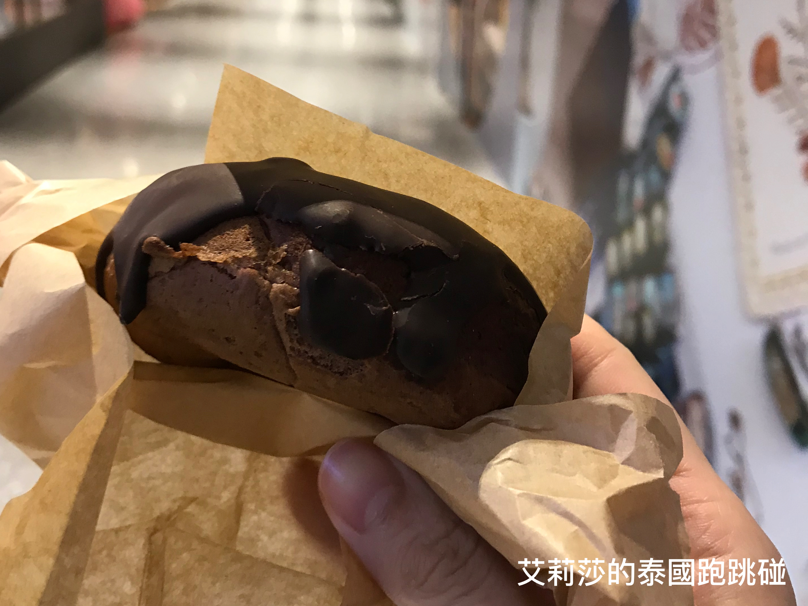

# \<泰國曼谷推薦\> Central World附近，高CP值點心 - 打動甜食控的甜甜圈

甜食一直都是我這個吃貨飯後必備的步驟，人生就是要有甜食的存在，吃飯流程才算完整！大家供丟唔丟啊（喊口號～)

在進入甜點之前，我想跟大家稍微介紹曼谷的Central world附近的伊勢丹百貨，伊勢丹屬於日系百貨公司，風格較精緻有質感。在這你可以找到日本的超市、麵包店、餐廳、廚房用品店、玩具用品與服飾店...等。我自己還蠻喜歡在伊勢丹的超市逛逛，因為這邊超市你可以感受到日本百貨注重細節跟清潔度，逛起來比其他的超市來的舒適自在！  

我常在**伊勢丹5樓的超市**找尋一些其他超市比較難買到的煮飯配料（鰹魚露、做飯糰的撒料等等)，離題推薦一款在伊勢丹超市買到的做飯糰極佳的幫手，這款日式的梅子撒料，輕輕鬆鬆就可以做出適合戶外野餐的梅子飯糰！梅子口味酸酸甜甜的滋味相間在米飯之中，吃起來清爽的口感最適合這種炎熱的天氣了～

超市同一層樓有許多賣日本甜食的商家，舉凡是迷你小可頌、Royce巧克力、大福、燒丸子、大判燒、抹茶冰淇淋等等，都可以在這層樓找到，完全是打中我這個覺得採買很辛苦，需要點心來撫慰心靈才不覺得自己像主婦的女人！😭也是在這層樓，我的目光被山夢庵這間店給吸引住了！

雖然是個甜食控，但我不是像螞蟻的那種喜歡加了許多糖分的甜食，個人比較偏好的是持久耐吃且不膩口的甜食，如果你跟我一樣喜歡這類型的甜食種類，今天介紹的山夢庵甜甜圈你絕對不能錯過。看到山夢庵的店面，映入你眼簾的是許多排排站可愛的甜甜圈在架上，好像是在跟你招手說：選我！選我！除了甜甜圈外，山夢庵還有賣銅鑼燒、黑糖銅鑼燒、鯛魚燒、黑糖饅頭等日本傳統甜食，但艾莉莎還是最推薦這邊的甜甜圈！  

架上有許多口味可以選擇，第一次買的時候猶豫了好久(女人的選擇障礙)，挑了**巧克力口味**的甜甜圈，剛開始以為會跟其他大型連鎖店賣的甜甜圈一樣屬於瞬間衝高血糖的甜甜圈，但...但...但...沒想到吃了之後，啟動了我內心的小宇宙啊！巧克力的甜沒有完全覆蓋掉麵糰的滋味，反而在口中相互襯托甜甜圈的樸實簡單，就是這個簡單純樸的滋味成功收服我的味蕾，讓我一試成主顧，常特地跑來伊勢丹買這家的甜甜圈！  

你沒有看錯！每種口味的甜甜圈都是**25泰銖**，CP 值相當高，是不是很佛心的甜點?! 選好你的口味後，店員會幫你簡單的包裝，一拿到甜甜圈，就忍不住在路上把它打開來嗑了！瞧瞧那飽滿的麵團搭配外層巧克力，麵團剛烤出來的蓬鬆綿密感搭配外層吃起來脆脆的巧克力，讓人每嚼一口，嘴角都不自覺的默默上揚。默默吶喊：這才是甜甜圈啊！！不得不給它一百分！（內心撒花)  

有時我下午時段去山夢庵，很多口味都售罄，所以建議大家如果想要前往購買的朋友，可以大概**午餐時段**那時候去，口味會比較齊全喔！有來泰國曼谷玩的朋友，一定要來嘗試一下曼谷好吃的甜甜圈喔！

**伊勢丹百貨 Isetan - 山夢庵**

地址：5F, 4/1- 4/2 CentralWorld Plaza, Rajdamri Road, Pathumwan, Bangkok, Thailand   
[（怎麼走）](https://goo.gl/maps/1CeZjnpX8J52)  
營業時間：10:30 - 21:30  
特色：日系甜品、高CP值

